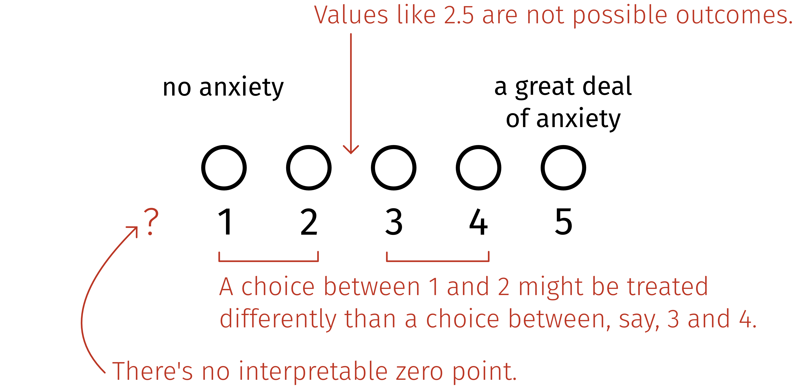

```{r setup, include = FALSE}
library(tidyverse)
library(renderthis)
library(MASS)

# To solve some conflicts between packages
select <- dplyr::select

# knitr settings
knitr::opts_chunk$set(
  # fig.width=7, fig.height=5, out.width = "60%", 
  fig.retina=3,
  fig.align = "center",
  cache = FALSE,
  echo = TRUE,
  message = FALSE, 
  warning = FALSE,
  hiline = TRUE
)
knitr::opts_knit$set(root.dir = here::here())

# dplyr and ggplot settings
options(dplyr.summarise.inform = FALSE)
theme_set(theme_bw())
theme_update(
  text = element_text(family = "Fira Sans", size = 18),
  axis.title.y = element_text(angle=0, vjust=0.5, hjust = 0),
  panel.grid = element_blank(),
  strip.background = element_blank()
)

palette_gender <- c( '#882e72', '#1965b0', '#4eb265')
palette_ab <- c('#72190e', '#F1932D')
```

<!-- ## But first: -->

<!-- Go to `menti.com` and enter code `3459 5977`. -->

<!-- Or scan QR code: -->

<!--  -->


.pull-left[
## The mistake
]

.pull-right[
## How you'll avoid it
]

--

.pull-left[
`r fontawesome::fa("code", height = '1em', margin_right = '0.2em')`
**A common R programming mistake:**
Letting R treat all variables that consist of numbers as numeric.
]

.pull-right[
]

--

.pull-left[
`r fontawesome::fa("chart-simple", height = '1em', margin_right = '0.2em')` 
**An advanced statistical mistake:**
Modelling categorical, ordinal data as if it were numeric.
]

.pull-right[
]

--

.pull-left[
`r fontawesome::fa("asterisk", height = '1em', margin_right = '0.2em')`
**A foundational statistical mistake:**
Interpreting a significant *p*-value as evidence that an effect exists.
]

.pull-right[
]

---
class: inverse, middle, center

`r fontawesome::fa("table", height = '5em')`

# The data we'll use

---

## The SMARVUS dataset (Terry et al., 2023)

.center[SMARVUS = **S**tatistics and **M**athematics **A**nxieties and **R**elated **V**ariables in **U**niversity **S**tudents]

--

.pull-left[
A survey of *n* = 18,841 students (mostly Psychology UGs) from 35 countries.

Students rated their anxiety from 1 (no anxiety) to 5 (a great deal of anxiety) in scenarios like:

- Studying for a statistics test.

- Interpreting the meaning of a table in a journal article.

- **Going to ask my statistics teacher for individual help with material I am having difficulty understanding. → ** 
]

--

.pull-right[

```{r read-in-anx, include=F}
anx <- read_csv('data/anx.csv')
anx <- select(anx, unique_id, gender, score) |> 
  rename(rating = score) |>
  mutate(gender = factor(gender, levels = c('Female/Woman', 'Male/Man', 'Another Gender')))
```

```{r bar-aggregated, echo=F, fig.width=7, fig.height=5.5}
anx |>
  ggplot(aes(x = factor(rating))) +
  geom_bar(fill = '#2e3836') +
  theme_classic() +
  theme(text = element_text(family = "Fira Sans", size = 24)) +
  labs(
    x = element_blank(),
    y = 'Count',
    caption = 'n = 8,314'
  ) +
  scale_x_discrete(labels = c('1\n(no anxiety)', '2', '3', '4', '5\n(a great deal\nof anxiety)')) +
  NULL
```

]

---

## Why Likert scale ratings are not continuous numeric

.center[

]

---
count:false

## Why Likert scale ratings are not continuous numeric

.center[

]

---
count:false

## Why Likert scale ratings are not continuous numeric

.center[

]

---
count:false

## Why Likert scale ratings are not continuous numeric

.center[

]

---

## And yet...

--

.pull-left[


Reeder et al. (2017) in **Journal of Memory and Language.**

]

.pull-right[


Elazar et al. (2022) in **Cognitive Science.**

<br>


Harrigan et al. (2022) in **Language.**

]


---

## R will keep numeric-looking data numeric

--

.pull-left[

```{r}
head(anx, 3)
```

]

--

.pull-right[

If we allow R's default behaviour, then we can do naughty things with categorical variables:

```{r}
mean(anx$rating)
```

]

--

But if we **store these variables as factors,** the naughty things become impossible (yay!):

```{r}
anx <- anx |> mutate(rating = factor(rating))

mean(anx$rating)
```

---


.pull-left[
## The mistake
]

.pull-right[
## How you'll avoid it
]

.pull-left[
`r fontawesome::fa("code", height = '1em', margin_right = '0.2em')`
**A common R programming mistake:**
Letting R treat all variables that consist of numbers as numeric.
]

.pull-right[
]

.pull-left[
`r fontawesome::fa("chart-simple", height = '1em', margin_right = '0.2em')` 
**An advanced statistical mistake:**
Modelling categorical, ordinal data as if it were numeric.
]

.pull-right[
]

.pull-left[
`r fontawesome::fa("asterisk", height = '1em', margin_right = '0.2em')`
**A foundational statistical mistake:**
Interpreting a significant *p*-value as evidence that an effect exists.
]

.pull-right[
]


---
count:false

.pull-left[
## The mistake
]

.pull-right[
## How you'll avoid it
]

.pull-left[
`r fontawesome::fa("code", height = '1em', margin_right = '0.2em')`
**A common R programming mistake:**
Letting R treat all variables that consist of numbers as numeric.
]

.pull-right[
When you know a variable is categorical, tell R that using `factor()`.
]

.pull-left[
`r fontawesome::fa("chart-simple", height = '1em', margin_right = '0.2em')` 
**An advanced statistical mistake:**
Modelling categorical, ordinal data as if it were numeric.
]

.pull-right[
]

.pull-left[
`r fontawesome::fa("asterisk", height = '1em', margin_right = '0.2em')`
**A foundational statistical mistake:**
Interpreting a significant *p*-value as evidence that an effect exists.
]

.pull-right[
]


---
class: inverse, middle, center

`r fontawesome::fa("magnifying-glass-chart", height = '5em')`

# Modelling an ordinal variable

### The .mono-white[polr()] express

---

## Model ordinal data with `polr()`

polr = **P**roportional **O**dds **L**ogistic **R**egression

--

```{r anx_fit1, message=F}
library(MASS)        # MASS contains the polr() function

anx_fit1 <- polr(
  rating ~ 1,        # intercept-only model, to start
  data = anx, 
  Hess = TRUE,       # required if we want to use summary()
  method = 'probit'  # more on this in a moment
)
```

---

##  Model ordinal data with `polr()`

```{r anx_fit1-summary, message=F}
summary(anx_fit1)
```

---

## What do those `Intercepts` mean?

--

```{r echo=F}
get_probs_btwn_thresholds <- function(zetas){
  # zetas: a vector of thresholds (numeric) in Phi space (estimated by polr model).
  
  # Back-transform thresholds into probability space. Currently cumulative.
  prob_spc_thresholds <- pnorm(zetas)  
  
  # Add first and last elements to this cumsum so that successive differences come out right.
  probs_btwn_thresholds <- diff( c(`1` = 0, prob_spc_thresholds, 'x' = 1) )
  
  # Rename each element in the vector to the between-threshold sections.
  names(probs_btwn_thresholds) <- 1:length(probs_btwn_thresholds)
  
  return(probs_btwn_thresholds)
}
```


```{r plot-underlying-normal, echo = F, fig.width = 12, fig.height = 6}
# prob_labs <- tibble(
#   x = c(-3, -1.4, -0.5, 0.1, 0.7, 1.5),
#   d = c(0.05),
#   labs = c('Prob:', round(get_probs_btwn_thresholds(anx_fit1$zeta), 2))
# )

rating_labs <- tibble(
  x = c(-2.6, -1.4, -0.5, 0.1, 0.7, 1.5),
  d = c(0.45),
  labs = c('Rating:', 1:5)
)

p_underlying_normal <- tibble(x = seq(from = -3.5, to = 3.5, length.out = 200)) %>% 
  mutate(d = dnorm(x = x)) %>% 
  ggplot(aes(x = x, y = d)) +
  geom_area(fill = '#2e3836', alpha = 0.4) +
  # geom_vline(xintercept = anx_fit1$zeta, linetype = 'dotted', linewidth = 2) +  # thresholds
  # geom_text(data = rating_labs, aes(label = labs), family = "Fira Sans", size = 12) +
  scale_x_continuous(
    'Anxiety (imaginary underlying variable)',
    breaks = -3:3,
    sec.axis = dup_axis(
      name = NULL,
      breaks = anx_fit1$zeta %>% as.double(),
      labels = round(anx_fit1$zeta, 2)
    )
    ) +
  scale_y_continuous(
    NULL, 
    breaks = NULL,
    limits = c(0, 0.5)
    ) +
  coord_cartesian(xlim = c(-3, 3)) +
  theme_classic() +
  theme( 
    text = element_text(family = "Fira Sans", size = 24),
    axis.line.x.top = element_blank(),
    axis.ticks.x.top = element_blank(),
    axis.text.x.top = element_text(size=28, colour = 'white')
  ) +
  NULL

p_underlying_normal
```

???

- imagine that there's some underlying continuous normal distribution of anxiety, assumed standard normal [show normal distrib]
- ppl with high anxiety are more likely to give high responses, ppl with low anxiety more likely to give low responses (could do emojis relating to anxiety: `r fontawesome::fa("face-smile-beam", height = '1em')`, `r fontawesome::fa("face-grimace", height = '1em')`)
- so to estimate how different anxiety levels translate to different responses on the 1--5 scale, we draw thresholds on that distribution [add thresholds]
- ppl with anxiety in this bin will respond with 1, in this bin with 2, etc.
- and those thresholds, the cutpoints btwn ratings, are the intercepts.
- [show intercept estimates, put thoes same numbers on the thresholds]
- normal distribution assumption is from method = probit. other methods assume other underlying distributions, but the idea of thresholds is the same.

---
count: false

## What do those `Intercepts` mean?

```{r plot-underlying-normal2, message=F, echo = F, fig.width = 12, fig.height = 6}
p_underlying_normal +
  geom_vline(xintercept = anx_fit1$zeta, linetype = 'dotted', linewidth = 1) +  # thresholds
  scale_x_continuous(
    'Anxiety (imaginary underlying variable)',
    breaks = -3:3,
    sec.axis = dup_axis(
      name = NULL,
      breaks = anx_fit1$zeta %>% as.double(),
      labels = round(anx_fit1$zeta, 2)
    )
  ) +
  geom_text(data = rating_labs, aes(label = labs), family = "Fira Sans", size = 12) +
  theme(axis.text.x.top = element_text(size=28, colour = 'white')) +
  NULL
```

---
count: false

## What do those `Intercepts` mean?

```{r plot-underlying-normal3, message=F, echo = F, fig.width = 12, fig.height = 6}
p_underlying_normal +
  geom_vline(xintercept = anx_fit1$zeta, linetype = 'dotted', linewidth = 1) +  # thresholds
  scale_x_continuous(
    'Anxiety (imaginary underlying variable)',
    breaks = -3:3,
    sec.axis = dup_axis(
      name = NULL,
      breaks = anx_fit1$zeta %>% as.double(),
      labels = round(anx_fit1$zeta, 2)
    )
  ) +
  geom_text(data = rating_labs, aes(label = labs), family = "Fira Sans", size = 12) +
  theme(axis.text.x.top = element_text(size=28, colour = 'black')) +
  NULL
```


---
class: inverse, middle, center

`r fontawesome::fa("mars-and-venus-burst", height = '5em')`

# Stats anxiety and gender

---

#### How does a student's gender affect how they respond to "Going to ask my statistics teacher for individual help with material I am having difficulty understanding"?

--

.pull-left[

```{r plot-gender-bars, echo = FALSE, fig.width=7, fig.height=7}
anx %>%
  ggplot(aes(x = rating, fill = gender)) +
  geom_bar() +
  facet_wrap(~ gender, scales = 'free', nrow=3) +
  scale_fill_manual(values = palette_gender) +
  theme_classic() +
  theme(legend.position = 'none',
        strip.background = element_blank(),
        text = element_text(family = 'Fira Sans', size = 24)) +
  labs(
    x = element_blank(),
    y = 'Count'
  ) +
  scale_x_discrete(labels = c('1\n(no anxiety)', '2', '3', '4', '5\n(a great deal\nof anxiety)')) +
  NULL
```
]

--

.pull-right[

<br> <br>

`r fontawesome::fa("hourglass-start", margin_right = '0.2em', height = '1em')` **First:** Think to yourself about the questions.

`r fontawesome::fa("hourglass-half", margin_right = '0.2em', height = '1em')` **Then:** Ask your neighbour what they think. What's their reasoning? What's yours?

`r fontawesome::fa("hourglass-end", margin_right = '0.2em', height = '1em')` **Afterward:** we'll look at the model's estimates together and discuss.

]

---

```{r anx_fit2-fit-manip, echo = F}
anx_fit2 <- polr(
  rating ~ gender,
  data = anx,
  method = 'probit',
  Hess = TRUE
)

anx_fit2_latent_normals <- tibble(
  Gender = factor(c('Female/Woman', 'Male/Man', 'Another Gender'), levels = c('Female/Woman', 'Male/Man', 'Another Gender')),
  mu     = c(0, coef(anx_fit2))
) |>
  tidyr::expand(
    nesting(Gender, mu),
    x = seq(from = -4, to = 4, length.out = 200)
  ) |>
  mutate(
    d = dnorm(x, mean = mu, sd = 1)  # get dens at each x value for normal distrib with each row's mu
  )

get_thresholds_anx_fit2 <- function(levelname){
  # levelname: string, one of 'Female/Woman', 'Male/Man', 'Another Gender'
  
  eta_male <- anx_fit2$coefficients[['genderMale/Man']] 
  eta_anot <- anx_fit2$coefficients[['genderAnother Gender']] 
  x_male <- contrasts(anx$gender)[levelname,][['Male/Man']]
  x_anot <- contrasts(anx$gender)[levelname,][['Another Gender']]
  
  # no link function, but computing the position on the Phi scale of each threshold using the following specifications:
  # linkfn(Phat(Y <= 1)) = –0.90 – (–0.33 * `Male/Man`) – (0.48 * `Another Gender`)
  phi_12 <- anx_fit2$zeta[['1|2']] - (eta_male * x_male) - (eta_anot * x_anot)
  
  # linkfn(Phat(Y <= 2)) = –0.22 – (–0.33 * `Male/Man`) – (0.48 * `Another Gender`)
  phi_23 <- anx_fit2$zeta[['2|3']] - (eta_male * x_male) - (eta_anot * x_anot)
  
  # linkfn(Phat(Y <= 3)) =  0.33 – (–0.33 * `Male/Man`) – (0.48 * `Another Gender`)
  phi_34 <- anx_fit2$zeta[['3|4']] - (eta_male * x_male) - (eta_anot * x_anot)
  
  # linkfn(Phat(Y <= 4)) =  0.99 – (–0.33 * `Male/Man`) – (0.48 * `Another Gender`)
  phi_45 <- anx_fit2$zeta[['4|5']] - (eta_male * x_male) - (eta_anot * x_anot)
  
  return( c('1|2' = phi_12, '2|3' = phi_23, '3|4' = phi_34, '4|5' = phi_45) )
}

fem_probs <- get_probs_btwn_thresholds( get_thresholds_anx_fit2('Female/Woman') )
```


.center[

```{r include=F}
rating_labs <- tibble(
  x = c(-2.6, -1.4, -0.5, 0.1, 0.7, 1.5),
  d = c(0.3),
  labs = c('Rating:', 1:5),
  Gender = c('Female/Woman')
)

anx_fit2_latent_normals |>
  filter(Gender == 'Female/Woman') |>
  ggplot(aes(x = x, y = d, fill = Gender)) +
  geom_area(position = 'identity', alpha = 0.5) +
  geom_vline(xintercept = anx_fit2$zeta, linetype = 'dotted', linewidth = 2) +
  geom_vline(xintercept = 0, colour = palette_gender[1]) +
  geom_text(data = rating_labs, aes(label = labs), family = 'Fira Sans', size = 24) +
  scale_fill_manual(values = palette_gender) +
  theme_classic() +
  theme(
    axis.line.x.top = element_blank(),
    text = element_text(family = 'Fira Sans', size = 24)
  ) +
  scale_y_continuous(NULL, breaks = NULL, limits = c(0, 0.5)) +
  scale_x_continuous(
    'Anxiety (imaginary underlying variable)', 
    breaks = -3:3,
    sec.axis = dup_axis(
      name = NULL,
      breaks = anx_fit2$zeta %>% as.double(),
      labels = round(anx_fit2$zeta, 2)
    )) +
  NULL
```


```{r fem-normal, echo=F, fig.width = 13, fig.height = 8}
rating_labs <- tibble(
  x = c(-2.6, -1.4, -0.6, 0.1, 0.7, 1.5),
  d = c(0.57),
  labs = c('Rating:', 1:5),
  Gender = c('Female/Woman')
)

p_fem_normal <- anx_fit2_latent_normals |>
  filter(Gender == 'Female/Woman') |>
  ggplot(aes(x = x, y = d, fill = Gender)) +
  geom_area(position = 'identity', alpha = 0.5) +
  geom_vline(xintercept = anx_fit2$zeta, linetype = 'dotted', linewidth = 1) +
  geom_vline(xintercept = 0, colour = palette_gender[1], linewidth = 1.5) +
  geom_text(data = rating_labs, aes(label = labs), family = 'Fira Sans', size = 12) +
  scale_fill_manual(values = palette_gender) +
  theme_classic() +
  theme(
    axis.line.x.top = element_blank(),
    axis.ticks.x.top = element_blank(),
    text = element_text(family = 'Fira Sans', size = 24),
    axis.text.x.top = element_text(family = 'Fira Sans', size = 24, colour = 'black'),
    legend.position = 'bottom'
  ) +
  scale_y_continuous(NULL, breaks = NULL, limits = c(0, 0.6)) +
  scale_x_continuous(
    'Anxiety (imaginary underlying variable)', 
    breaks = -3:3,
    sec.axis = dup_axis(
      name = NULL,
      breaks = anx_fit2$zeta %>% as.double(),
      labels = round(anx_fit2$zeta, 2)
    )) +
  NULL

p_fem_normal
```
]

---
count: false

```{r fem-mal-normals, echo=F, fig.width = 13, fig.height = 8}
mm_mean <- anx_fit2$coefficients[['genderMale/Man']]

anx_fit2_latent_normals |>
  filter(Gender %in% c('Female/Woman', 'Male/Man')) |>
  ggplot(aes(x = x, y = d, fill = Gender)) +
  geom_area(position = 'identity', alpha = 0.5) +
  geom_vline(xintercept = anx_fit2$zeta, linetype = 'dotted', linewidth = 1) +
  geom_vline(linewidth = 1.5, xintercept = 0, colour = palette_gender[1]) +
  geom_vline(linewidth = 1.5, xintercept = mm_mean, colour = palette_gender[2]) +
  geom_text(data = rating_labs, aes(label = labs), family = 'Fira Sans', size = 12) +
  scale_fill_manual(values = palette_gender) +
  theme_classic() +
  theme(
    axis.line.x.top = element_blank(),
    axis.ticks.x.top = element_blank(),
    text = element_text(family = 'Fira Sans', size = 24),
    axis.text.x.top = element_text(family = 'Fira Sans', size = 24, colour = 'black'),
    legend.position = 'bottom'
  ) +
  scale_y_continuous(NULL, breaks = NULL, limits = c(0, 0.6)) +
  scale_x_continuous(
    'Anxiety (imaginary underlying variable)', 
    breaks = -3:3,
    sec.axis = dup_axis(
      name = NULL,
      breaks = anx_fit2$zeta %>% as.double(),
      labels = round(anx_fit2$zeta, 2)
    )) +
  geom_segment(aes(x= 0, y = 0.44, xend = mm_mean, yend = 0.44), linewidth = 2, arrow = arrow(length = unit(0.5,"cm")), colour = palette_gender[2]) +
  geom_label(aes(x = -0.33, y = 0.49), label = round(mm_mean, 2), fill = 'white', colour = palette_gender[2], family = 'Fira Sans', size = 10) +
  NULL
```


---
count: false

```{r all-gender-normals, echo=F, fig.width = 13, fig.height = 8}
ag_mean <- anx_fit2$coefficients[['genderAnother Gender']]

anx_fit2_latent_normals |>
  ggplot(aes(x = x, y = d, fill = Gender)) +
  geom_area(position = 'identity', alpha = 0.5) +
  geom_vline(xintercept = anx_fit2$zeta, linetype = 'dotted', linewidth = 1) +
  geom_vline(linewidth = 1.5, xintercept = 0, colour = palette_gender[1]) +
  geom_vline(linewidth = 1.5, xintercept = mm_mean, colour = palette_gender[2]) +
  geom_vline(linewidth = 1.5, xintercept = ag_mean, colour = palette_gender[3]) +
  geom_text(data = rating_labs, aes(label = labs), family = 'Fira Sans', size = 12) +
  scale_fill_manual(values = palette_gender) +
  theme_classic() +
  theme(
    axis.line.x.top = element_blank(),
    axis.ticks.x.top = element_blank(),
    text = element_text(family = 'Fira Sans', size = 24),
    axis.text.x.top = element_text(family = 'Fira Sans', size = 24, colour = 'black'),
    legend.position = 'bottom'
  ) +
  scale_y_continuous(NULL, breaks = NULL, limits = c(0, 0.6)) +
  scale_x_continuous(
    'Anxiety (imaginary underlying variable)', 
    breaks = -3:3,
    sec.axis = dup_axis(
      name = NULL,
      breaks = anx_fit2$zeta %>% as.double(),
      labels = round(anx_fit2$zeta, 2)
    )) +
  geom_segment(aes(x= 0, y = 0.44, xend = mm_mean, yend = 0.44), linewidth = 2, arrow = arrow(length = unit(0.5,"cm")), colour = palette_gender[2]) +
  geom_label(aes(x = -0.33, y = 0.49), label = round(mm_mean, 2), fill = 'white', colour = palette_gender[2], family = 'Fira Sans', size = 10) +
  geom_segment(aes(x= 0, y = 0.44, xend = ag_mean, yend = 0.44), linewidth = 2, arrow = arrow(length = unit(0.5,"cm")), colour = palette_gender[3]) +
  geom_label(aes(x = 0.48, y = 0.49), label = round(ag_mean, 2), fill = 'white', colour = palette_gender[3], family = 'Fira Sans', size = 10) +
  NULL
```

---

```{r include=F}
anx_fit2 <- polr(
  rating ~ gender,
  data = anx,
  method = 'probit',
  Hess = TRUE
)
```


```{r anx_fit2-display, eval = FALSE}
anx_fit2 <- polr(
  rating ~ gender,
  data = anx,
  method = 'probit',
  Hess = TRUE
)
summary(anx_fit2)
```

```
## Coefficients:
##                        Value Std. Error t value
## genderMale/Man       -0.3280    0.03015 -10.880
## genderAnother Gender  0.4846    0.11992   4.041
## 
## Intercepts:
##     Value    Std. Error t value 
## 1|2  -0.9045   0.0169   -53.5402
## 2|3  -0.2246   0.0150   -14.9847
## 3|4   0.3318   0.0151    21.9158
## 4|5   0.9889   0.0176    56.2958
```

---


.pull-left[
## The mistake
]
.pull-right[
## How you'll avoid it
]
<!--  -->
.pull-left[
`r fontawesome::fa("code", height = '1em', margin_right = '0.2em')`
**A common R programming mistake:**
Letting R treat all variables that consist of numbers as numeric.
]
.pull-right[
When you know a variable is categorical, tell R that using `factor()`.
]
<!--  -->
.pull-left[
`r fontawesome::fa("chart-simple", height = '1em', margin_right = '0.2em')` 
**An advanced statistical mistake:**
Modelling categorical, ordinal data as if it were numeric.
]
.pull-right[
]
<!--  -->
.pull-left[
`r fontawesome::fa("asterisk", height = '1em', margin_right = '0.2em')`
**A foundational statistical mistake:**
Interpreting a significant *p*-value as evidence that an effect exists.
]
.pull-right[
]

---
count: false

.pull-left[
## The mistake
]
.pull-right[
## How you'll avoid it
]
<!--  -->
.pull-left[
`r fontawesome::fa("code", height = '1em', margin_right = '0.2em')`
**A common R programming mistake:**
Letting R treat all variables that consist of numbers as numeric.
]
.pull-right[
When you know a variable is categorical, tell R that using `factor()`.
]
<!--  -->
.pull-left[
`r fontawesome::fa("chart-simple", height = '1em', margin_right = '0.2em')` 
**An advanced statistical mistake:**
Modelling categorical, ordinal data as if it were numeric.
]
.pull-right[
Apply and interpret ordinal regression models (e.g., `polr()` from `MASS`).
]
<!--  -->
.pull-left[
`r fontawesome::fa("asterisk", height = '1em', margin_right = '0.2em')`
**A foundational statistical mistake:**
Interpreting a significant *p*-value as evidence that an effect exists.
]
.pull-right[
]

---
class: inverse, middle, center

`r fontawesome::fa("asterisk", height = '5em')`

# Interpreting *p*-values

---

## Are the effects of `gender` significant?

```{r include=F}
# summary(anx_fit2)
```

```
## Coefficients:
##                        Value Std. Error t value
## genderMale/Man       -0.3280    0.03015 -10.880
## genderAnother Gender  0.4846    0.11992   4.041
```

No *p*-values in the model summary.

--

But it's common practice to compare these *t*-values to a standard normal distribution.

--

```{r anx_fit2-coef-pvals1, echo=T}
pnorm(abs(-10.880), lower.tail = FALSE) * 2
pnorm(abs(  4.041), lower.tail = FALSE) * 2
```

???

Since both *p*-values are below 0.05:

- we CAN reject the null hypothesis that gender has no effect on ratings.
- **we CANNOT conclude that there really is an effect of gender.**

---

### Why don't significant *p*-values mean an effect exists?

Because we can also get significant *p*-values when there really is *no* effect.

--

.pull-left[
No difference in the true population:

```{r true-skew-probdist, echo=F, fig.height = 5}
TRUE_PROBDIST <- c(.4, .25, .15, .1, .1)
  
tibble(
  group = rep(c('Group A', 'Group B'), each = 5),
  score = rep(1:5, 2),
  prob = rep(TRUE_PROBDIST, 2)  # skewed
) |>
  ggplot(aes(x = factor(score), y = prob, fill = group)) +
  geom_bar(stat = 'identity') +
  theme_classic() +
  facet_wrap(~ group, nrow = 2) +
  theme(
    legend.position = 'none',
    text = element_text(family = 'Fira Sans', size = 24),
    strip.background = element_blank()
  ) +
  labs(
    x = element_blank(),
    y = 'True probability'
  ) +
  scale_y_continuous(
    limits = c(0, 1),
    breaks = c(0, 0.5, 1)
  ) +
  scale_fill_manual(values = palette_ab) +
  scale_x_discrete(labels = c('1\n(no anxiety)', '2', '3', '4', '5\n(a great deal\n of anxiety)')) +
  NULL
```
]

--

.pull-right[
A possible random sample (*n* = 50 per group):

```{r simdat, echo=F, fig.height = 5}
SAMPLE_SIZE <- 50
set.seed(1)
sample_a <- sample(x = 1:5, size = SAMPLE_SIZE, replace = TRUE, prob = TRUE_PROBDIST)

set.seed(24)
sample_b <- sample(x = 1:5, size = SAMPLE_SIZE, replace = TRUE, prob = TRUE_PROBDIST)
  
simdat <- tibble(
  group = rep(c('Group A', 'Group B'), each = SAMPLE_SIZE),
  rating = factor(c(sample_a, sample_b))
)

simdat |> 
  ggplot(aes(x = rating, fill = group)) +
  geom_bar() +
  facet_wrap(~ group, nrow = 2) +
  theme_classic() +
  theme(
    legend.position = 'none',
    text = element_text(family = 'Fira Sans', size = 24),
    strip.background = element_blank()
  ) +
  scale_fill_manual(values = palette_ab) +
  labs(
    y = 'Count',
    x = element_blank(),
    ) +
  scale_x_discrete(labels = c('1\n(no anxiety)', '2', '3', '4', '5\n(a great deal\n of anxiety)')) +
  NULL
```

]

---

### Why don't significant *p*-values mean an effect exists?

```{r eval = FALSE}
sim_fit <- polr(rating ~ group, data = simdat, method = 'probit', Hess = TRUE)
summary(sim_fit)  
```

```
## Coefficients:
##                Value Std. Error t value
## groupGroup B -0.4479     0.2229  -2.009
```

<br>

--

```{r}
pnorm(abs(-2.009), lower.tail = FALSE) * 2
```

So *p* is below 0.05, but in the true population, Group A and Group B were identical!

---


.pull-left[
## The mistake
]
.pull-right[
## How you'll avoid it
]
<!--  -->
.pull-left[
`r fontawesome::fa("code", height = '1em', margin_right = '0.2em')`
**A common R programming mistake:**
Letting R treat all variables that consist of numbers as numeric.
]
.pull-right[
When you know a variable is categorical, tell R that using `factor()`.
]
<!--  -->
.pull-left[
`r fontawesome::fa("chart-simple", height = '1em', margin_right = '0.2em')` 
**An advanced statistical mistake:**
Modelling categorical, ordinal data as if it were numeric.
]
.pull-right[
Apply and interpret ordinal regression models (e.g., `polr()` from `MASS`).
]
<!--  -->
.pull-left[
`r fontawesome::fa("asterisk", height = '1em', margin_right = '0.2em')`
**A foundational statistical mistake:**
Interpreting a significant *p*-value as evidence that an effect exists.
]
.pull-right[
]

---
count:false

.pull-left[
## The mistake
]
.pull-right[
## How you'll avoid it
]
<!--  -->
.pull-left[
`r fontawesome::fa("code", height = '1em', margin_right = '0.2em')`
**A common R programming mistake:**
Letting R treat all variables that consist of numbers as numeric.
]
.pull-right[
When you know a variable is categorical, tell R that using `factor()`.
]
<!--  -->
.pull-left[
`r fontawesome::fa("chart-simple", height = '1em', margin_right = '0.2em')` 
**An advanced statistical mistake:**
Modelling categorical, ordinal data as if it were numeric.
]
.pull-right[
Apply and interpret ordinal regression models (e.g., `polr()` from `MASS`).
]
<!--  -->
.pull-left[
`r fontawesome::fa("asterisk", height = '1em', margin_right = '0.2em')`
**A foundational statistical mistake:**
Interpreting a significant *p*-value as evidence that an effect exists.
]
.pull-right[
Understand that significant *p*-values can arise even if no effect exists.
]

--

<br>

.center[**Thank you! `r fontawesome::fa("face-smile-beam", height = '2em', vertical_align = '-0.5em', margin_left = '0.2em', margin_right = '0.2em')` Time for questions!**]

---
count: false

## References

Elazar, A., Alhama, R. G., Bogaerts, L., Siegelman, N., Baus, C., & Frost, R. (2022). When the "tabula" is anything but "rasa": What determines performance in the auditory statistical learning task? *Cognitive Science*, 46(2), e13102.

Harrigan, K., Hogoboom, A., & Cochrane, L. (2022). Furthering student engagement: Lab sections in introductory linguistics. *Language*, 98(4), e199–e223.

Reeder, P. A., Newport, E. L., & Aslin, R. N. (2017). Distributional learning of subcategories in an artificial grammar: Category generalization and subcategory restrictions. *Journal of Memory and Language*, 97, 17–29.

Terry, J., Ross, R. M., Nagy, T., Salgado, M., Garrido-Vásquez, P., Sarfo, J. O., Cooper, S., Buttner, A. C., Lima, T. J. S., Öztürk, İ., Akay, N., Santos, F. H., Artemenko, C., Copping, L. T., Elsherif, M. M., Milovanović, I., Cribbie, R. A., Drushlyak, M. G., Swainston, K., … Field, A. P. (2023). Data from an International Multi-Centre Study of Statistics and Mathematics Anxieties and Related Variables in University Students (the SMARVUS Dataset). *Journal of Open Psychology Data*, 11(1), 8.


---
count: false

## Helpful resources

- Jamieson's (2004) paper _[Likert scales: How to (ab)use them](https://onlinelibrary.wiley.com/doi/10.1111/j.1365-2929.2004.02012.x)_

- UCLA Statistical Methods and Data Analytics's web page _[Ordinal Logistic Regression](https://stats.oarc.ucla.edu/r/dae/ordinal-logistic-regression/)_

- A. Solomon Kurz' (2021) blog post _[Notes on the Bayesian cumulative probit](https://stats.oarc.ucla.edu/r/dae/ordinal-logistic-regression/)_

- Gelman & Hill's (2007) book _[Data Analysis Using Regression and Multilevel/Hierarchical Models](https://www.cambridge.org/highereducation/books/data-analysis-using-regression-and-multilevel-hierarchical-models/32A29531C7FD730C3A68951A17C9D983)_
